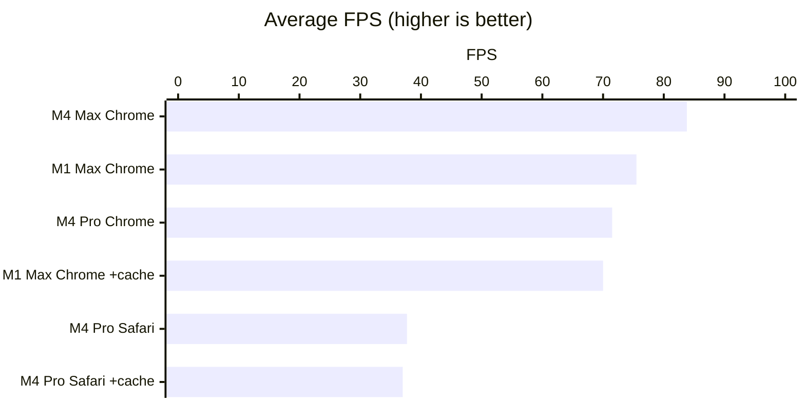
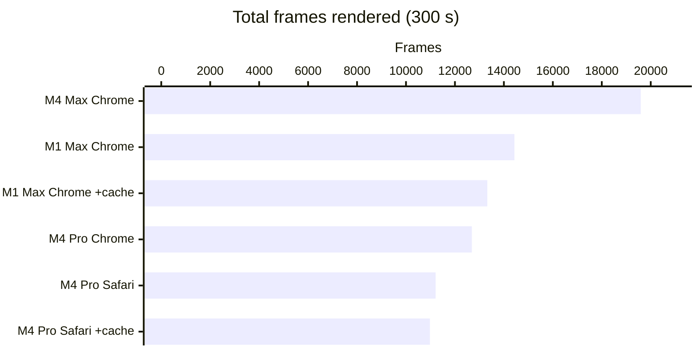

# OpenSkyFlight — Benchmarks

Performance comparison across different Apple Silicon configurations.
Each benchmark runs an automated **5-minute flight** (300 s) in `realworld` mode, chunk resolution 64, view distance 12, wireframe enabled, zoom 15, fog enabled, pixel ratio 2x.

> **Contribute!** Run the benchmark on your machine and submit your JSON file to expand this table.

## Tested configurations

| # | Machine | GPU cores | Browser | Cache | Canvas (logical) | Rendered pixels |
|---|---------|-----------|---------|-------|-------------------|-----------------|
| 1 | M1 Max | 32 | Chrome 145 | No | 2056 x 1290 | 4112 x 2580 |
| 2 | M4 Pro | 20 | Safari 26.3 | No | 1512 x 897 | 3024 x 1794 |
| 3 | M4 Pro | 20 | Safari 26.3 | Yes | 1512 x 897 | 3024 x 1794 |
| 4 | M4 Max | 40 | Chrome 146 | Yes | 2056 x 1290 | 4112 x 2580 |
| 5 | M4 Pro | 20 | Chrome 145 | N/A | 1512 x 949 | 3024 x 1898 |
| 6 | M1 Max | 32 | Chrome 145 | Yes | 2056 x 1290 | 4112 x 2580 |

## Average FPS by configuration

## FPS distribution: avg, p5 and p1

This chart shows the stability of each configuration. A large gap between avg and p1 indicates framerate drops.

```mermaid
---
config:
    xyChart:
        chartOrientation: horizontal
        width: 800
        height: 400
---
xychart-beta
    title "FPS - avg / p5 / p1"
    x-axis ["M4 Max Chrome", "M1 Max Chrome", "M4 Pro Chrome", "M1 Max Chrome +cache", "M4 Pro Safari", "M4 Pro Safari +cache"]
    y-axis "FPS" 0 --> 100
    bar [83.8, 75.5, 71.5, 70.0, 37.7, 37.0]
    bar [47.8, 27.1, 30.5, 23.9, 32.3, 31.3]
    bar [17.0, 10.9, 11.0, 9.7, 30.3, 28.6]
```

> **How to read**: tall bar = avg FPS, medium bar = p5 (95% of frames above), short bar = p1 (99% of frames above). Safari shows a p1 very close to the avg = high stability.

## Results - FPS (detail)

| # | Machine | Browser | Cache | FPS avg | FPS p5 | FPS p1 | FPS min |
|---|---------|---------|-------|--------:|-------:|-------:|--------:|
| 4 | **M4 Max** | Chrome | Yes | **83.8** | 47.8 | 17.0 | 8.0 |
| 1 | M1 Max | Chrome | No | 75.5 | 27.1 | 10.9 | 8.5 |
| 5 | M4 Pro | Chrome | N/A | 71.5 | 30.5 | 11.0 | 7.7 |
| 6 | M1 Max | Chrome | Yes | 70.0 | 23.9 | 9.7 | 6.9 |
| 2 | M4 Pro | Safari | No | 37.7 | 32.3 | 30.3 | 25.0 |
| 3 | M4 Pro | Safari | Yes | 37.0 | 31.3 | 28.6 | 23.3 |

## Average and p95 frame time

```mermaid
---
config:
    xyChart:
        chartOrientation: horizontal
        width: 800
        height: 400
---
xychart-beta
    title "Frame Time (ms) - avg / p95 (lower is better)"
    x-axis ["M4 Max Chrome", "M1 Max Chrome", "M1 Max Chrome +cache", "M4 Pro Chrome", "M4 Pro Safari", "M4 Pro Safari +cache"]
    y-axis "ms" 0 --> 50
    bar [15.3, 20.8, 22.6, 23.6, 26.8, 27.3]
    bar [20.9, 36.9, 41.9, 32.8, 31.0, 32.0]
```

> **How to read**: short bar = avg frame time, tall bar = p95 (slowest 5% of frames). A large gap between the two indicates latency spikes.

## Results - Frame Time (detail, ms)

| # | Machine | Browser | Cache | FT avg | FT p95 | FT max |
|---|---------|---------|-------|-------:|-------:|-------:|
| 4 | **M4 Max** | Chrome | Yes | **15.3** | 20.9 | 124.6 |
| 1 | M1 Max | Chrome | No | 20.8 | 36.9 | 117.4 |
| 6 | M1 Max | Chrome | Yes | 22.6 | 41.9 | 144.9 |
| 5 | M4 Pro | Chrome | N/A | 23.6 | 32.8 | 129.6 |
| 2 | M4 Pro | Safari | No | 26.8 | 31.0 | 40.0 |
| 3 | M4 Pro | Safari | Yes | 27.3 | 32.0 | 43.0 |

## Chrome vs Safari on M4 Pro

```mermaid
---
config:
    xyChart:
        width: 600
        height: 350
---
xychart-beta
    title "M4 Pro - Chrome vs Safari"
    x-axis ["FPS avg", "FPS p5", "FPS p1", "FPS min"]
    y-axis "FPS" 0 --> 80
    bar [71.5, 30.5, 11.0, 7.7]
    bar [37.7, 32.3, 30.3, 25.0]
```

> **How to read**: Chrome (1st series) vs Safari (2nd series). Chrome has 2x the avg FPS, but Safari never drops below 23 FPS vs 7.7 for Chrome.

## Total frames rendered in 5 min

## Results - Geometry and draw calls

| # | Machine | Browser | Triangles avg | Triangles max | Draw calls avg | Draw calls max |
|---|---------|---------|---------------:|---------------:|---------------:|---------------:|
| 4 | M4 Max | Chrome | 57 012 328 | 68 423 694 | 432 | 518 |
| 1 | M1 Max | Chrome | 56 905 880 | 68 423 694 | 431 | 518 |
| 5 | M4 Pro | Chrome | 55 980 808 | 64 829 454 | 425 | 491 |
| 6 | M1 Max | Chrome | 55 204 224 | 65 628 174 | 419 | 497 |
| 2 | M4 Pro | Safari | 54 524 612 | 64 430 094 | 414 | 488 |
| 3 | M4 Pro | Safari | 53 867 955 | 64 829 454 | 409 | 491 |

## Results - Total frames rendered

| # | Machine | Browser | Cache | Total frames | Effective frames/s |
|---|---------|---------|-------|-------------:|-------------------:|
| 4 | M4 Max | Chrome | Yes | 19 594 | 65.3 |
| 1 | M1 Max | Chrome | No | 14 431 | 48.1 |
| 6 | M1 Max | Chrome | Yes | 13 323 | 44.1 |
| 5 | M4 Pro | Chrome | N/A | 12 690 | 42.3 |
| 2 | M4 Pro | Safari | No | 11 211 | 37.4 |
| 3 | M4 Pro | Safari | Yes | 10 978 | 36.6 |

## Analysis

### Raw GPU performance: M4 Max dominates

The M4 Max (40 GPU cores) achieves the best avg FPS (**83.8**) and the best avg frame time (**15.3 ms**), with +47% more frames rendered compared to the M1 Max on Chrome. It is the only configuration that comfortably exceeds 60 FPS on average.

### Chrome vs Safari: a major gap

On the M4 Pro, switching from Safari to Chrome boosts avg FPS from **37** to **71.5** (+93%). However, Safari shows much more **stable** behavior:
- **Safari**: FPS min 23-25, p1 28-30, p5 31-32 (low variance)
- **Chrome**: FPS min 7.7, p1 11, p5 30.5 (very high peaks, very low troughs)

Chrome leverages the GPU better via ANGLE/Metal but with much higher variance. Safari caps at ~47 FPS (likely limited by WebKit compositing) but never drops below 23 FPS.

### Cache impact: negligible on Safari, mixed on Chrome

On M4 Pro Safari, cache enabled vs disabled yields nearly identical results (37.0 vs 37.7 FPS). Tile caching has no measurable impact once the scene is loaded.

On M1 Max Chrome, caching even appears to slightly **degrade** performance (70.0 vs 75.5 avg FPS), possibly due to memory overhead or different run conditions.

### M1 Max vs M4 Pro: close on Chrome

Despite its 32 GPU cores vs 20, the M1 Max does not significantly outperform the M4 Pro on Chrome (75.5 vs 71.5 FPS). The M4 architecture compensates for fewer cores with better per-core efficiency.

### Frame time: watch out for spikes

All Chrome configurations show frame time spikes above 100 ms (chunk loading). Safari keeps spikes at 40-43 ms max, providing a perceptually smoother experience despite lower avg FPS.

## Benchmark protocol

To submit a result:

1. Open the OpenSkyFlight application
2. Start the automated benchmark (5-minute flight)
3. The JSON file is generated automatically at the end
4. Name the file: `benchmark-<DATE>-<MACHINE>-<CACHE|NOCACHE>-<BROWSER>.json`
5. Submit via PR or issue

### Benchmark parameters (identical for all runs)

| Parameter | Value |
|-----------|-------|
| Terrain mode | `realworld` |
| Chunk resolution | 64 |
| View distance | 12 |
| Hi-res mode | No |
| Wireframe | Yes |
| Zoom | 15 |
| Fog | Yes |
| Clouds | No |
| Max pixel ratio | 2 |
| Duration | 300 s |
