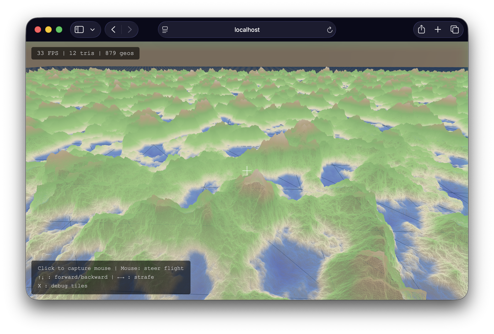
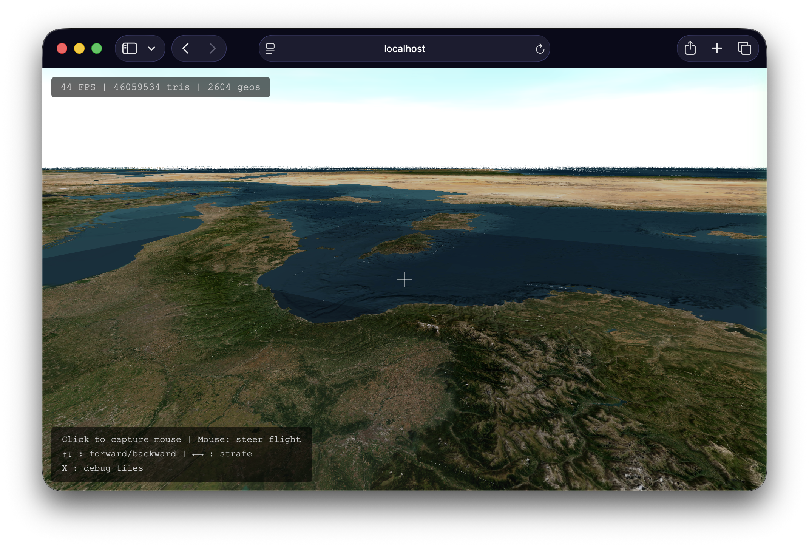
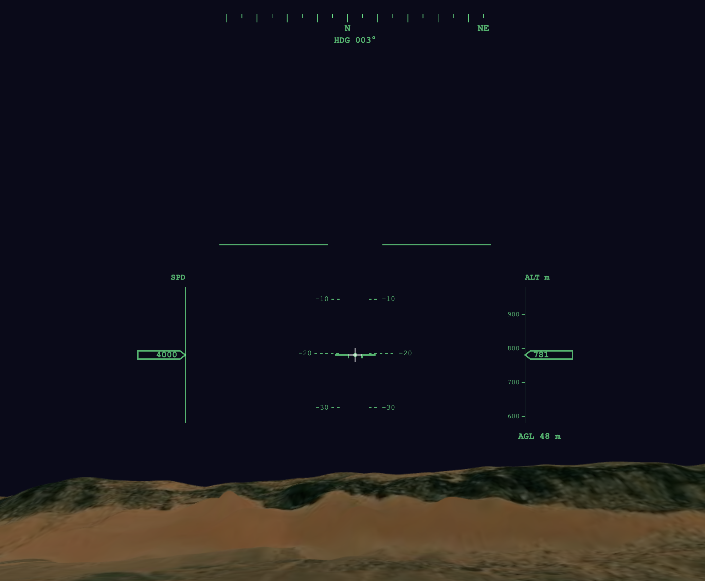
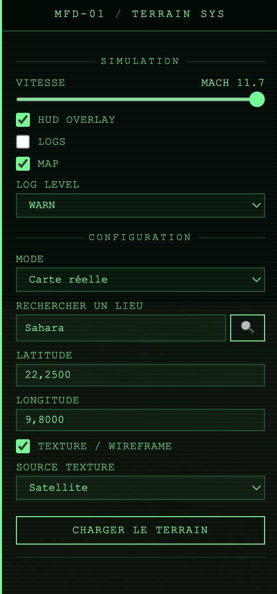
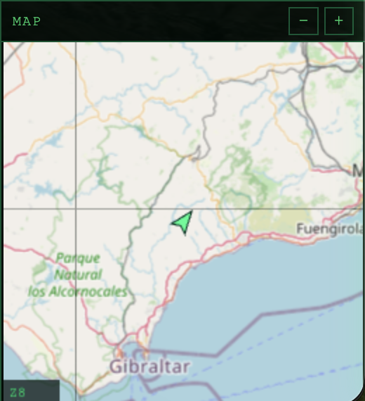
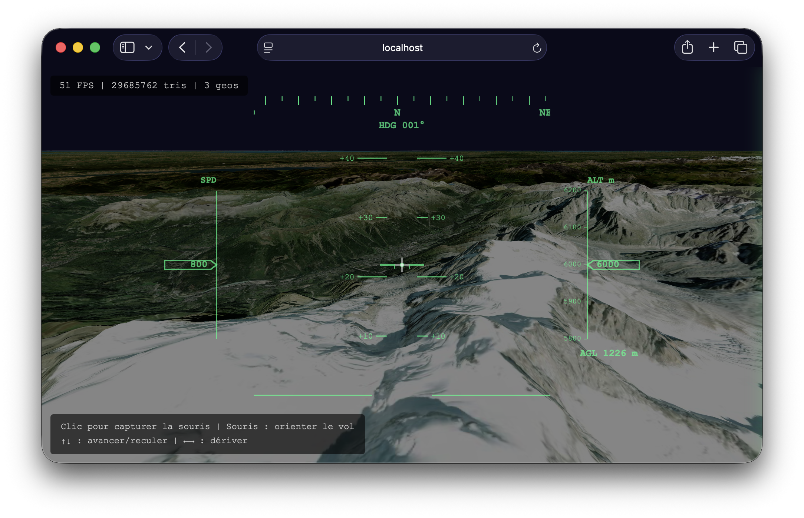

# OpenSkyFlight

A browser-based 3D flight simulator over real-world terrain. Fly anywhere on Earth using satellite imagery and elevation data from OpenStreetMap and AWS Terrarium — all rendered in real time with Three.js WebGPU. No install, no build step.


<!-- Hero screenshot: full-screen flight over mountains with HUD, satellite textures, and minimap visible -->


## Features

- **Dual terrain modes** — procedural (Simplex noise) or real-world (elevation tiles)

| Procedural terrain | Real-world terrain |
|---|---|
|  |  |
- **Real-world elevation** — decoded from [AWS Terrarium](https://registry.opendata.aws/terrain-tiles/) PNG tiles on the GPU via TSL `positionNode`, with spherical Earth curvature
- **Satellite & map textures** — ESRI World Imagery or OpenStreetMap raster overlay, switchable at runtime
- **Hi-Res mode (zoom 18)** — press `H` to toggle upsampled elevation with zoom-18 satellite textures for sharper close-up detail
- **Adaptive LOD** — quadtree subdivision based on camera altitude, covering up to the geometric horizon
- **Rafale aircraft** — 3D GLTF model with animated banking and pitch, chase camera (30 m behind)
- **Cockpit / chase toggle** — press `V` to switch between first-person cockpit (roll applied to horizon) and third-person chase view
- **Flight simulator controls** — 6-DOF camera with pointer lock, banking, pitch/yaw
- **Aircraft-style HUD** — compass, artificial horizon, altimeter (MSL + AGL), speed indicator
- **MFD cockpit panel** — auto-hiding control panel with military flight display aesthetics
- **OSM minimap** — real-time 2D map overlay with airplane marker and independent zoom

<!-- Screenshots: HUD close-up | MFD control panel | Minimap -->
| HUD instruments | MFD control panel | OSM minimap |
|---|---|---|
|  |  |  |
- **Dynamic chunk loading** — spiral-ordered around camera, with frustum culling
- **Web Worker** — terrain geometry built off the main thread (zero-copy ArrayBuffer transfer)
- **Local tile cache** — transparent caching proxy, pre-download tiles for offline flight
- **Atmospheric sky, clouds & fog** — procedural sky with configurable sun position, animated cloud layer, and exponential distance fog
- **Dynamic resolution scaling** — adaptive pixel ratio based on frame time to maintain smooth performance
- **Built-in benchmark** — automated camera path with FPS/GPU timing, metrics recording, and baseline comparison
- **Centralized logging** — in-app log panel with level control (DEBUG/INFO/WARN/ERROR)

## Quick Start

No dependencies to install. Start the dev server:

```bash
node scripts/serve.js
```

Then open [http://localhost:3000](http://localhost:3000) in your browser.

The server acts as a **caching proxy** for map tiles — every tile downloaded from the internet is automatically saved to `cache/` on disk, so it's never fetched twice.

### Controls

| Input | Action |
|---|---|
| Click the viewport | Lock the mouse pointer |
| Mouse | Look around (yaw / pitch) |
| `W` / `S` or `↑` / `↓` | Move forward / backward |
| `A` / `D` or `←` / `→` | Strafe left / right |
| `V` | Toggle cockpit / chase view |
| `I` | Toggle info & help overlay |
| `B` | Start / stop benchmark |
| `Shift+B` | Store last benchmark as baseline |
| `H` | Toggle Hi-Res mode (zoom 18) |
| `X` | Toggle debug tile overlay |
| `Esc` | Release pointer lock |

Use the right-side control panel to switch between **Procedural** and **Real-World** modes, adjust terrain parameters, and toggle wireframe or textures.

## Building geo-three (dev only)

The terrain engine relies on [geo-three](https://github.com/tentone/geo-three), a Three.js geographic tile library. The upstream project no longer appears to be actively maintained, so we vendor its source code in `vendor/geo-three/source/` in order to apply our own patches and extensions (Three.js r152+ compatibility, custom providers, etc.).

If you modify the sources, rebuild the bundle:

```bash
cd vendor/geo-three
npm install   # first time only
npm run build
```

This produces `vendor/geo-three/geo-three.module.js`, which the app already imports via import map — no other change needed.

## Real-World Mode

Switch to **Real-World** in the control panel, enter coordinates (or search a place name), then click **Load Terrain**. The app fetches elevation data from AWS Terrarium and optionally overlays satellite or OSM textures.

Default location: **Mont Blanc** (45.8326°N, 6.8652°E).

| Satellite textures | OpenStreetMap textures | Wireframe mode |
|---|---|---|
|  |  |  |

*Left: ESRI satellite imagery. Center: OpenStreetMap cartography projected on relief. Right: wireframe mode with MFD-style green overlay.*

## How It Works

1. **Elevation** — Terrarium PNG tiles (AWS S3) are decoded into heightmaps on the GPU via a TSL `positionNode` shader (`R×256 + G + B/256 − 32768` meters)
2. **Mesh generation** — A Web Worker builds terrain geometry from heightmaps, transferred back via zero-copy ArrayBuffers
3. **LOD system** — `buildLodRings()` uses recursive quadtree subdivision: tiles near the camera are split into 4 children at higher zoom, distant tiles stay coarse
4. **Earth curvature** — Vertex positions are projected onto a sphere (`_projectOnSphere`), so distant terrain curves away naturally
5. **Textures** — Satellite (ESRI) or OSM tiles are fetched on demand and applied as `CanvasTexture` to terrain meshes
6. **Caching** — A Node.js proxy intercepts all `/tiles/` requests: serves from disk on hit, fetches upstream on miss, caches for next time

## Tile Cache

The dev server (`scripts/serve.js`) acts as a transparent caching proxy. When the browser requests a tile:

1. **Cache hit** — the file exists in `cache/`, served instantly from disk (`X-Cache: HIT`)
2. **Cache miss** — fetched from the remote server, saved to `cache/`, then returned (`X-Cache: MISS`)

Every tile is downloaded **at most once**. Subsequent sessions, or navigating back to a previously visited area, will always load from the local cache.

```
cache/
  terrarium/        ← elevation tiles (AWS Terrarium)
  osm/              ← map textures (OpenStreetMap)
  satellite/        ← satellite imagery (ESRI)
```

> The `cache/` directory is listed in `.gitignore` and should not be committed — it can be regenerated at any time.


## Project Structure

```
├── index.html                     Main HTML page (MFD-styled UI)
├── js/
│   ├── app.js                     Scene setup, render loop & keyboard shortcuts
│   ├── atmosphere/
│   │   ├── AtmosphericSky.js      Procedural sky, sun positioning & fog
│   │   └── CloudLayer.js          Animated cloud layer
│   ├── aircraft/
│   │   └── AircraftManager.js     Rafale model, chase/cockpit camera modes
│   ├── benchmark/
│   │   ├── BenchmarkRunner.js     Automated benchmark with camera path
│   │   ├── BenchmarkComparator.js Baseline comparison & reporting
│   │   ├── CameraPath.js          Predefined flight path for benchmarks
│   │   ├── GPUTimer.js            GPU-side frame timing
│   │   └── MetricsCollector.js    Per-frame metrics recording
│   ├── camera/
│   │   └── FPSController.js       Flight camera (pointer lock, 6-DOF, banking)
│   ├── terrain/
│   │   ├── ChunkManager.js        Chunk lifecycle, LOD dispatch
│   │   ├── GeoTerrainManager.js   Real-world terrain via geo-three, hi-res toggle
│   │   ├── TerrainChunk.js        Geometry & mesh for one chunk
│   │   ├── NoiseGenerator.js      Simplex noise (fBm)
│   │   └── terrainWorker.js       Web Worker for off-thread generation
│   ├── geo/
│   │   ├── TileMath.js            Slippy Map math, quadtree LOD, horizon calc
│   │   ├── ElevationProvider.js   Terrarium tile fetch + decode
│   │   ├── TerrariumProvider.js   geo-three height provider (zoom-15 upsampling to 18)
│   │   ├── LocalTileProvider.js   geo-three texture provider (via proxy)
│   │   ├── TextureProvider.js     OSM/satellite tile fetch
│   │   └── fetchSemaphore.js      Browser-side concurrency limiter
│   ├── ui/
│   │   ├── HUD.js                 Flight instrument overlay + hi-res badge
│   │   ├── Minimap.js             OSM minimap with airplane marker
│   │   └── ControlPanel.js        MFD settings panel
│   └── utils/
│       ├── config.js              Reactive configuration system
│       └── Logger.js              Centralized logging with UI panel
├── scripts/
│   ├── serve.js                   Dev server with caching tile proxy
│   └── prefetch-tiles.js          Bulk tile downloader for offline use
└── cache/                         Local tile cache (git-ignored)
```

## Technologies

- [Three.js](https://threejs.org/) v0.183 (WebGPU build) — 3D rendering with TSL shaders (loaded via CDN, no install)
- [geo-three](https://github.com/tentone/geo-three) — geographic tile management and Mercator projection
- Web Workers — off-thread terrain generation
- Canvas 2D — HUD instrument overlay, hi-res badge, and minimap
- [three/examples — Sky](https://threejs.org/examples/?q=sky#webgl_shaders_sky) — procedural atmospheric sky and sun
- [AWS Terrarium Tiles](https://registry.opendata.aws/terrain-tiles/) — elevation data (zoom 0–15, upsampled to 18 in hi-res mode)
- [OpenStreetMap](https://www.openstreetmap.org/) — map textures
- [ESRI World Imagery](https://www.arcgis.com/home/item.html?id=10df2279f9684e4a9f6a7f08febac2a9) — satellite textures (up to zoom 18+)
- Node.js — dev server with transparent caching tile proxy and offline prefetch script
- ES modules + import maps — no bundler needed

## Data Sources & Attribution

OpenSkyFlight does not bundle or redistribute any map data. All tiles are fetched at runtime by the user's browser through a local caching proxy. Users are responsible for complying with each provider's terms of use.

### Elevation data — Mapzen Terrain Tiles (AWS)

Elevation tiles are sourced from the [Mapzen Terrain Tiles](https://registry.opendata.aws/terrain-tiles/) open dataset hosted on AWS S3. The underlying data comes from multiple public domain and open data sources including USGS 3DEP, SRTM, GMTED2010, and others.

- **License:** mixed open data — mostly public domain (US government), some CC-BY (Australia), Open Government Licence (Canada)
- **Attribution:** terrain data courtesy of [Mapzen](https://www.mapzen.com/rights/). See the full [attribution guide](https://github.com/tilezen/joerd/blob/master/docs/attribution.md) for regional sources.
- No API key required. No rate limit.

### Map textures — OpenStreetMap

Map tiles are fetched from the [OpenStreetMap](https://www.openstreetmap.org/) tile server.

- **License:** map data is available under the [Open Database License (ODbL)](https://opendatacommons.org/licenses/odbl/). Tile images are licensed under [CC-BY-SA 2.0](https://creativecommons.org/licenses/by-sa/2.0/).
- **Attribution:** © [OpenStreetMap](https://www.openstreetmap.org/copyright) contributors.
- **Usage policy:** the public tile server is intended for light, interactive use. See the [OSM Tile Usage Policy](https://operations.osmfoundation.org/policies/tiles/) for details. For heavy or production use, consider a self-hosted tile server or a commercial provider.

### Satellite imagery — Esri World Imagery

Satellite tiles are fetched from the [Esri World Imagery](https://www.arcgis.com/home/item.html?id=10df2279f9684e4a9f6a7f08febac2a9) basemap service.

- **License:** proprietary — governed by the [Esri Terms of Use](https://www.esri.com/en-us/legal/terms/full-master-agreement). Non-commercial use is permitted with attribution. Commercial use requires a paid Esri license.
- **Attribution:** powered by Esri. Sources: Esri, Maxar, Earthstar Geographics, and the GIS User Community.
- Users consuming this data are responsible for complying with Esri's terms.

### Geocoding — Nominatim

Place name search uses the [Nominatim](https://nominatim.openstreetmap.org/) geocoding API.

- **License:** results are OpenStreetMap data under [ODbL](https://opendatacommons.org/licenses/odbl/).
- **Attribution:** © [OpenStreetMap](https://www.openstreetmap.org/copyright) contributors.
- **Usage policy:** max 1 request/second, no bulk geocoding. See the [Nominatim Usage Policy](https://operations.osmfoundation.org/policies/nominatim/).

## License

This project's source code is licensed under MIT. Map data, imagery, and elevation data are subject to their respective licenses listed above.
