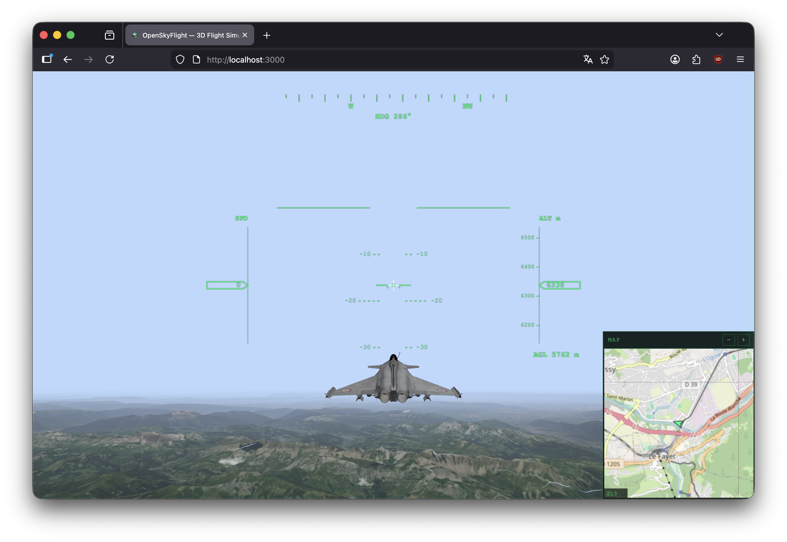
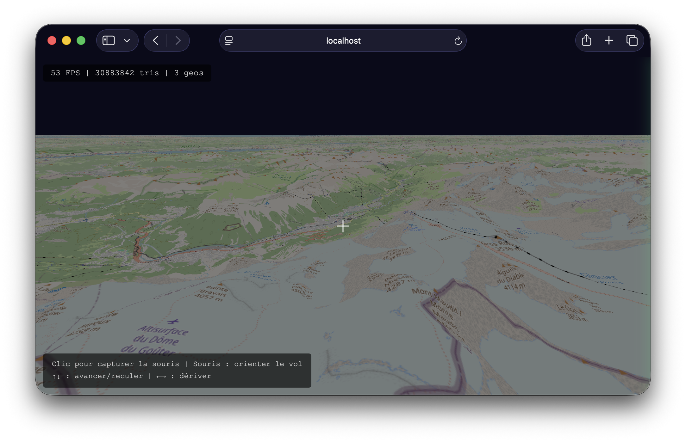
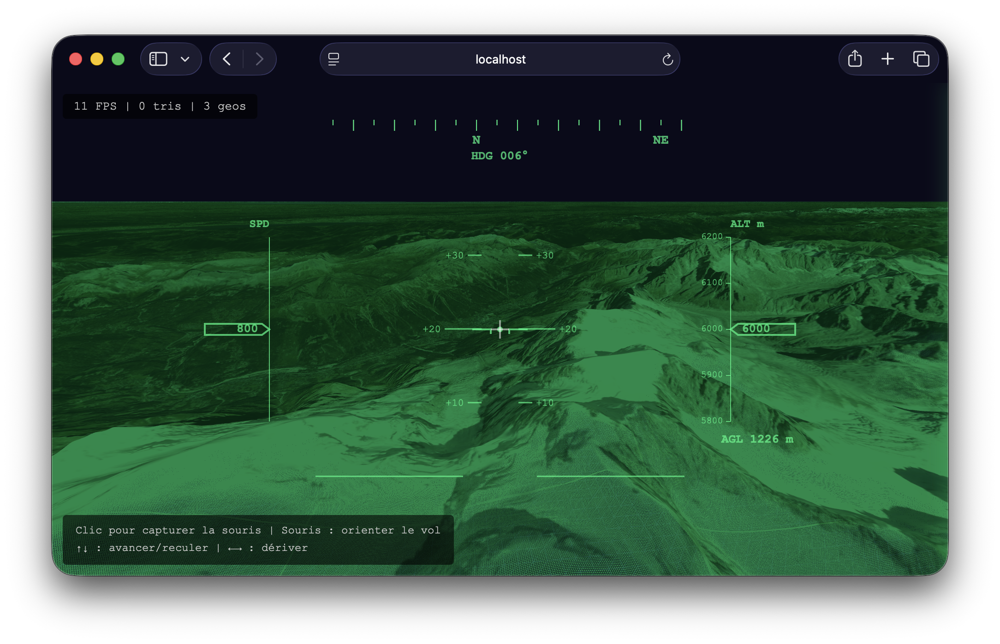
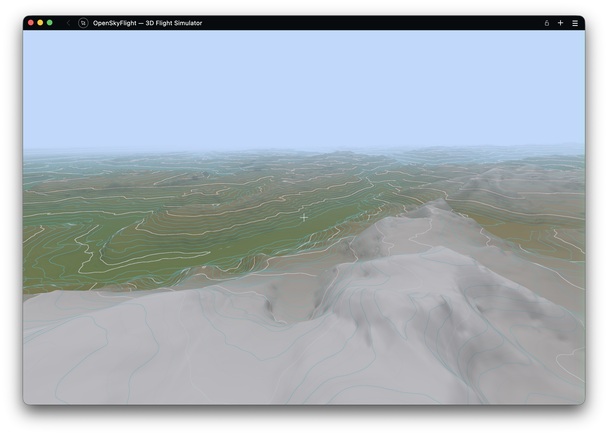

# OpenSkyFlight

A browser-based 3D flight simulator over real-world terrain. Fly anywhere on Earth using elevation data from AWS Terrarium and multiple texture modes (satellite, road map, SAR radar, elevation contours) — all rendered in real time with Three.js WebGPU. No install, no build step, no API key.


<!-- Hero screenshot: full-screen flight over mountains with HUD, satellite textures, and minimap visible -->


## Features

- **Real-world elevation** — decoded from [AWS Terrarium](https://registry.opendata.aws/terrain-tiles/) PNG tiles on the GPU via TSL `positionNode`
- **4 texture modes** — Satellite imagery, Road map, SAR radar, and Elevation contour lines — cycle with `T` or pick from the control panel
- **Hi-Res mode (zoom 18)** — press `R` to toggle upsampled elevation with zoom-18 satellite textures for sharper close-up detail
- **Adaptive LOD** — quadtree subdivision based on camera altitude, covering up to the geometric horizon
- **Rafale aircraft** — 3D GLTF model with retracted landing gear, animated banking and pitch, chase camera (30 m behind)
- **Cockpit / chase toggle** — press `V` to switch between first-person cockpit (roll applied to horizon) and third-person chase view
- **Flight simulator controls** — 6-DOF camera with pointer lock, banking, pitch/yaw, full 360° looping
- **Aircraft-style HUD** — compass, artificial horizon, altimeter (MSL + AGL), speed indicator
- **MFD cockpit panel** — auto-hiding control panel with military flight display aesthetics
- **OSM minimap** — real-time 2D map overlay with airplane marker and independent zoom
- **Flight plan system** — record waypoints, save/load flight plans, and engage autopilot to follow a path automatically

<!-- Screenshots: HUD close-up | MFD control panel | Minimap -->
<!-- TODO: recapture mfd-panel.png — the control panel now shows a single TEXTURE select instead of 3 separate controls -->
| HUD instruments | MFD control panel | OSM minimap |
|---|---|---|
|  |  |  |
- **Local tile cache** — transparent caching proxy, pre-download tiles for offline flight
- **Atmospheric sky, clouds & fog** — procedural sky with configurable sun position, animated cloud layer, and exponential distance fog
- **Dynamic resolution scaling** — adaptive pixel ratio based on frame time to maintain smooth performance
- **Built-in benchmark** — automated camera path with FPS/GPU timing, metrics recording, and baseline comparison
- **Toast notifications** — non-blocking user feedback for search results and errors
- **Centralized logging** — in-app log panel with level control (DEBUG/INFO/WARN/ERROR)

<!-- Screenshot: chase camera view following the Rafale -->


*Third-person chase camera following the Rafale over satellite-textured terrain.*

## Quick Start

No dependencies needed to run the app. Start the dev server:

```bash
node scripts/serve.js
```

Then open [http://localhost:3000](http://localhost:3000) in your browser.

The server acts as a **caching proxy** for map tiles — every tile downloaded from the internet is automatically saved to `cache/` on disk, so it's never fetched twice.

### Development tools (optional)

Install dev dependencies for linting and formatting:

```bash
npm install
```

Available scripts:

| Command | Description |
|---|---|
| `npm run dev` | Start the dev server |
| `npm run lint` | Run ESLint |
| `npm run lint:fix` | Run ESLint with auto-fix |
| `npm run format` | Format all files with Prettier |
| `npm run format:check` | Check formatting without modifying files |

### Controls

| Input | Action |
|---|---|
| Click the viewport | Lock the mouse pointer |
| Mouse | Look around (yaw / pitch) |
| `W` / `S` or `↑` / `↓` | Move forward / backward |
| `A` / `D` or `←` / `→` | Strafe left / right |
| `T` | Cycle texture mode (Satellite / Road map / SAR / Elevation) |
| `V` | Toggle cockpit / chase view |
| `H` | Toggle HUD |
| `I` | Toggle info & help overlay |
| `R` | Toggle Hi-Res mode (zoom 18) |
| `X` | Toggle debug tile overlay |
| `B` | Start / stop benchmark |
| `Shift+B` | Store last benchmark as baseline |
| `N` | Start / stop flight plan recording |
| `Shift+N` | Clear current flight plan |
| `P` | Add waypoint (while recording) |
| `L` | Open / close flight plan menu |
| `G` | Engage / disengage autopilot |
| `1`–`9` | Select flight plan from menu |
| `Esc` | Release pointer lock / close menu |

Use the right-side control panel to search locations, load terrain, and select texture mode.

## Building geo-three (dev only)

The terrain engine relies on [geo-three](https://github.com/tentone/geo-three), a Three.js geographic tile library. The upstream project no longer appears to be actively maintained, so we vendor its source code in `vendor/geo-three/source/` in order to apply our own patches and extensions (Three.js r152+ compatibility, custom providers, deferred WebGPU resource disposal, etc.).

If you modify the sources, rebuild the bundle:

```bash
cd vendor/geo-three
npm install   # first time only
npm run build
```

This produces `vendor/geo-three/geo-three.module.js`, which the app already imports via import map — no other change needed.

## Real-World Mode

Enter coordinates (or search a place name) in the control panel, then click **Load Terrain**. The app fetches elevation data from AWS Terrarium and overlays one of four texture modes, switchable at runtime with `T` or the control panel.

Default location: **Mont Blanc** (45.8326°N, 6.8652°E).

<!-- Texture modes 2×2 grid — capture each mode at the same camera position over Mont Blanc -->
| Satellite | Road map |
|---|---|
|  |  |
| **SAR radar** | **Elevation lines** |
|  |  |

*Top-left: ESRI satellite imagery. Top-right: OpenStreetMap road map. Bottom-left: SAR radar style (black sky, side-looking light, grey speckle grain). Bottom-right: elevation contour lines (cyan lines on dark background).*

## How It Works

1. **Elevation** — Terrarium PNG tiles (AWS S3) are decoded into heightmaps on the GPU via a TSL `positionNode` shader (`R×256 + G + B/256 − 32768` meters)
2. **LOD system** — geo-three's `LODRaycastPruning` drives recursive quadtree subdivision: tiles near the camera are split into 4 children at higher zoom, distant tiles stay coarse
3. **Textures** — Four modes: Satellite (ESRI) and Road map (OSM) fetch raster tiles on demand; SAR radar and Elevation contours are GPU-generated via TSL shaders
4. **Caching** — A Node.js proxy intercepts all `/tiles/` requests: serves from disk on hit, fetches upstream on miss, caches for next time

## Tile Cache

The dev server (`scripts/serve.js`) acts as a transparent caching proxy. When the browser requests a tile:

1. **Cache hit** — the file exists in `cache/`, served instantly from disk (`X-Cache: HIT`)
2. **Cache miss** — fetched from the remote server, saved to `cache/`, then returned (`X-Cache: MISS`)

Every tile is downloaded **at most once**. Subsequent sessions, or navigating back to a previously visited area, will always load from the local cache.

```
cache/
  terrarium/        ← elevation tiles (AWS Terrarium)
  osm/              ← map textures (OpenStreetMap)
  satellite/        ← satellite imagery (ESRI)
```

> The `cache/` directory is listed in `.gitignore` and should not be committed — it can be regenerated at any time.


## Project Structure

```
├── index.html                     Main HTML page (MFD-styled UI)
├── css/
│   └── main.css                   External stylesheet with CSS custom properties
├── js/
│   ├── app.js                     Thin orchestrator: init, wiring & render loop
│   ├── constants/
│   │   ├── aircraft.js            Aircraft model dimensions & visual factors
│   │   ├── camera.js              FOV, altitudes, chase/FPS controller params
│   │   ├── hud.js                 HUD colors, instrument dimensions, compass data
│   │   ├── physics.js             Speed of sound, max delta time
│   │   ├── rendering.js           Clear color, clip planes, adaptive quality thresholds
│   │   └── terrain.js             Tile sizes, zoom limits, minimap & benchmark params
│   ├── atmosphere/
│   │   ├── AtmosphericSky.js      Procedural sky, sun positioning & fog
│   │   └── CloudLayer.js          Animated cloud layer
│   ├── aircraft/
│   │   └── AircraftManager.js     Rafale model loading & animation
│   ├── benchmark/
│   │   ├── BenchmarkRunner.js     Automated benchmark with camera path
│   │   ├── BenchmarkComparator.js Baseline comparison & reporting
│   │   ├── GPUTimer.js            GPU-side frame timing
│   │   └── MetricsCollector.js    Per-frame metrics recording
│   ├── camera/
│   │   ├── FPSController.js       Flight camera (pointer lock, 6-DOF, banking)
│   │   ├── ChaseCameraController.js Spring-based third-person camera
│   │   ├── SpringScalar.js        Critically-damped spring for scalar values
│   │   └── SpringVector3.js       Critically-damped spring for Vector3 values
│   ├── flightplan/
│   │   ├── FlightPlanRecorder.js  Waypoint recording, plan loading & autopilot
│   │   ├── FlightPlan.js          Interpolated flight path from waypoints
│   │   ├── DefaultFlightPlan.js   Built-in demo flight plan
│   │   └── Waypoint.js            Single waypoint data class
│   ├── input/
│   │   └── InputManager.js        Centralized keyboard dispatch
│   ├── rendering/
│   │   └── AdaptiveQualityManager.js Dynamic resolution scaling
│   ├── scene/
│   │   └── SceneSetup.js          Renderer, scene, camera & lights factory
│   ├── terrain/
│   │   └── GeoTerrainManager.js   Real-world terrain via geo-three, hi-res toggle
│   ├── geo/
│   │   ├── TileMath.js            Slippy Map math, quadtree LOD, horizon calc
│   │   ├── ElevationProvider.js   Terrarium tile fetch + decode
│   │   ├── TerrariumProvider.js   geo-three height provider (zoom-15 upsampling to 18)
│   │   ├── LocalTileProvider.js   geo-three texture provider (via proxy)
│   │   ├── TextureProvider.js     OSM/satellite tile fetch with deferred disposal
│   │   └── fetchSemaphore.js      Browser-side concurrency limiter
│   ├── ui/
│   │   ├── HUD.js                 HUD facade composing sub-modules
│   │   ├── hud/
│   │   │   ├── HUDRenderer.js     Canvas rendering of instruments & badges
│   │   │   ├── FlightPlanMenu.js  Flight plan selection overlay
│   │   │   └── SpeedTracker.js    Smoothed ground speed computation
│   │   ├── Minimap.js             OSM minimap with airplane marker
│   │   ├── ControlPanel.js        MFD settings panel
│   │   └── Notification.js        Toast notification system
│   └── utils/
│       ├── config.js              Reactive config with validation & JSDoc
│       └── Logger.js              Centralized logging with UI panel
├── scripts/
│   ├── serve.js                   Dev server with caching tile proxy
│   └── prefetch-tiles.js          Bulk tile downloader for offline use
├── vendor/
│   └── geo-three/                 Vendored geo-three with custom patches
├── assets/
│   ├── models/                    3D models (Rafale GLTF)
│   ├── flightplans/               Saved flight plan JSON files
│   └── favicon.png
├── docs/
│   └── screenshots/               README screenshots
├── benchmarks/                    Benchmark result JSON files
├── package.json                   Dev dependencies (ESLint, Prettier)
├── eslint.config.js               ESLint 9 flat config (ES modules)
├── .prettierrc                    Prettier configuration
├── .editorconfig                  Editor settings (indent, encoding, EOL)
└── cache/                         Local tile cache (git-ignored)
```

## Technologies

- [Three.js](https://threejs.org/) v0.183 (WebGPU build) — 3D rendering with TSL shaders (loaded via CDN, no install)
- [geo-three](https://github.com/tentone/geo-three) — geographic tile management and Mercator projection
- Canvas 2D — HUD instrument overlay, hi-res badge, and minimap
- [three/examples — Sky](https://threejs.org/examples/?q=sky#webgl_shaders_sky) — procedural atmospheric sky and sun
- [AWS Terrarium Tiles](https://registry.opendata.aws/terrain-tiles/) — elevation data (zoom 0–15, upsampled to 18 in hi-res mode)
- [OpenStreetMap](https://www.openstreetmap.org/) — road map textures
- [ESRI World Imagery](https://www.arcgis.com/home/item.html?id=10df2279f9684e4a9f6a7f08febac2a9) — satellite imagery (up to zoom 18+)
- Node.js — dev server with transparent caching tile proxy and offline prefetch script
- ES modules + import maps — no bundler needed
- [ESLint](https://eslint.org/) 9 + [Prettier](https://prettier.io/) — code quality and formatting (dev only)

## Browser Support

OpenSkyFlight uses **WebGPU** for rendering. Browser support varies significantly because each engine relies on a different backend:

| Browser | Backend | Status | Notes |
|---|---|---|---|
| **Chrome & Chromium-based** | Dawn (C++) | **Very Good** | Stable WebGPU since 2023, most mature implementation |
| **Firefox** | wgpu (Rust) | **Very Good** | ~90% spec coverage, may have minor rendering differences |
| **Safari** | WebKit + Metal | Very Bad | WebGPU enabled by default since Safari 26 (2025); visual artefacts, flickering, and performance instability due to Metal-specific constraints |

Even with identical WGSL shaders, each browser compiles and optimizes them through a different pipeline, which can produce subtle rendering differences. For the best experience, **use Chrome or a Chromium-based browser**.

## Data Sources & Attribution

OpenSkyFlight does not bundle or redistribute any map data. All tiles are fetched at runtime by the user's browser through a local caching proxy. Users are responsible for complying with each provider's terms of use.

### Elevation data — Mapzen Terrain Tiles (AWS)

Elevation tiles are sourced from the [Mapzen Terrain Tiles](https://registry.opendata.aws/terrain-tiles/) open dataset hosted on AWS S3. The underlying data comes from multiple public domain and open data sources including USGS 3DEP, SRTM, GMTED2010, and others.

- **License:** mixed open data — mostly public domain (US government), some CC-BY (Australia), Open Government Licence (Canada)
- **Attribution:** terrain data courtesy of [Mapzen](https://www.mapzen.com/rights/). See the full [attribution guide](https://github.com/tilezen/joerd/blob/master/docs/attribution.md) for regional sources.
- No API key required. No rate limit.

### Map textures — OpenStreetMap

Map tiles are fetched from the [OpenStreetMap](https://www.openstreetmap.org/) tile server.

- **License:** map data is available under the [Open Database License (ODbL)](https://opendatacommons.org/licenses/odbl/). Tile images are licensed under [CC-BY-SA 2.0](https://creativecommons.org/licenses/by-sa/2.0/).
- **Attribution:** © [OpenStreetMap](https://www.openstreetmap.org/copyright) contributors.
- **Usage policy:** the public tile server is intended for light, interactive use. See the [OSM Tile Usage Policy](https://operations.osmfoundation.org/policies/tiles/) for details. For heavy or production use, consider a self-hosted tile server or a commercial provider.

### Satellite imagery — Esri World Imagery

Satellite tiles are fetched from the [Esri World Imagery](https://www.arcgis.com/home/item.html?id=10df2279f9684e4a9f6a7f08febac2a9) basemap service.

- **License:** proprietary — governed by the [Esri Terms of Use](https://www.esri.com/en-us/legal/terms/full-master-agreement). Non-commercial use is permitted with attribution. Commercial use requires a paid Esri license.
- **Attribution:** powered by Esri. Sources: Esri, Maxar, Earthstar Geographics, and the GIS User Community.
- Users consuming this data are responsible for complying with Esri's terms.

### Geocoding — Nominatim

Place name search uses the [Nominatim](https://nominatim.openstreetmap.org/) geocoding API.

- **License:** results are OpenStreetMap data under [ODbL](https://opendatacommons.org/licenses/odbl/).
- **Attribution:** © [OpenStreetMap](https://www.openstreetmap.org/copyright) contributors.
- **Usage policy:** max 1 request/second, no bulk geocoding. See the [Nominatim Usage Policy](https://operations.osmfoundation.org/policies/nominatim/).

## License

This project's source code is licensed under MIT. Map data, imagery, and elevation data are subject to their respective licenses listed above.
